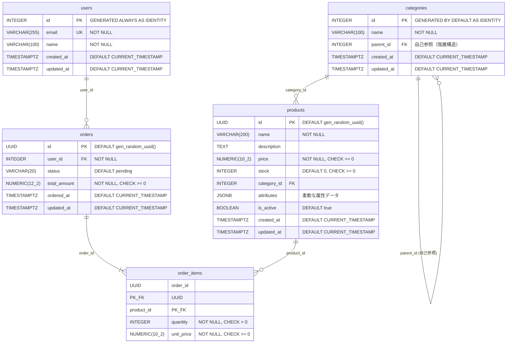

1.5章 テーブルの作成
---

# よく使うデータ型

### 数値型

| 型 | サイズ | 説明 |
|---|---|---|
| `SMALLINT` / `INT2` | 2バイト | 符号付き整数 |
| `INTEGER` / `INT` / `INT4` | 4バイト | 符号付き整数 |
| `BIGINT` / `INT8` | 8バイト | 符号付き整数 |
| `DECIMAL` / `NUMERIC` | サイズは可変 | 精度指定可能な正確な数値 <br> ※ 金額計算向け <br>  |
| `REAL` / `FLOAT4` | 4バイト | 単精度浮動小数点 <br> ※ 科学計算向け |
| `DOUBLE PRECISION` / `FLOAT8` | 8バイト | 倍精度浮動小数点 <br> ※ 科学計算向け |
| `SMALLSERIAL` / `SERIAL2` | 2バイト | 自動増分 (1 〜 32,767) |
| `SERIAL` / `SERIAL4` | 4バイト | 自動増分 (1 〜 2,147,483,647) |
| `BIGSERIAL` / `SERIAL8` | 8バイト | 自動増分 (1 〜 9,223,372,036,854,775,807) |

### 文字列型
| 型 | 説明 |
|----|------|
| `VARCHAR(n)` | 可変長文字列（最大n文字） |
| `CHAR(n)` | 固定長文字列（空白埋め） |
| `TEXT` | 可変長文字列（無制限） |


### 日付・時刻型

| 型 | サイズ | 精度 | 説明 |
|----|--------|------|------|
| `TIMESTAMPTZ` | 8バイト | 1μ秒 14桁 | 日付と時刻（タイムゾーン付き） |
| `TIMESTAMP` | 8バイト | 1μ秒 14桁 | 日付と時刻（タイムゾーンなし） |
| `DATE` | 4バイト | 1日 | 日付のみ |
| `TIMETZ` | 12バイト | 1μ秒 14桁 | 時刻（タイムゾーン付き） |
| `TIME` | 8バイト | 1μ秒 14桁 | 時刻のみ（タイムゾーンなし） |

### その他よく使う型

| 型 | 説明 |
|----|------|
| BOOLEAN | 真偽値 |
| JSONB | JSONデータ(インデックス可能) |
| TEXT[] | 配列 |
| UUID | UUID型 |

```sql
-- JSONBリテラル
SELECT '{"a": 1, "b": [1, 2, 3], "c": true}'::JSONB;
--                 jsonb                
-- -------------------------------------
--  {"a": 1, "b": [1, 2, 3], "c": true}

-- 配列リテラル  NOTE： 配列のリテラルは {}
SELECT '{a,b,c}'::TEXT[];
--   text   
-- ---------
--  {a,b,c}

-- UUID
SELECT gen_random_uuid();
--            gen_random_uuid            
-- --------------------------------------
--  d362dd27-459c-4a96-ad86-e4e5a89fecf0
```


### カラムへの指定方法

#### NUMERIC
- `NUMERIC(precision, scale)` 
    - precision=全体の桁数(整数部+小数部)
    - scale=小数点以下の桁数

```sql
-- NUMERIC
price NUMERIC(12, 2)   -- 一般的な金額(整数部=10桁, 小数部=2桁) (~99億)
price NUMERIC(3, 2)    -- 割合(整数部=1桁, 小数部=2桁) (0.00 - 9.99)
price NUMERIC          -- 度制限なし（任意の桁数を格納可能）
```

#### SERIAL, INTEGER

```sql
-- 自動採番（主キー用）
id SERIAL PRIMARY KEY               -- 旧形式
id INTEGER GENERATED ALWAYS AS IDENTITY PRIMARY KEY  -- 推奨
```

#### 文字列型

```sql
name VARCHAR(100)                   -- 可変長（最大100文字）
email TEXT                          -- 可変長（無制限）
code CHAR(5)                        -- 固定長（5文字、空白埋め）
```
#### 日付・時刻型

```sql
created_at TIMESTAMPTZ DEFAULT CURRENT_TIMESTAMP  -- 日時 (タイムゾーン付き、推奨) 
                                                  -- CURRENT_TIMESTAMP は now()でもOK
birth_date DATE                      -- 日時のみ
start_time TIMEZ                     -- 時刻のみ
```

`now()` と `CURRENT_TIMESTAMP` の違い:
| 項目 | `now()` | `CURRENT_TIMESTAMP` |
|------|---------|---------------------|
| 種類 | 関数 | SQL標準キーワード |
| 精度指定 | 不可 | 可能 <br>`CURRENT_TIMESTAMP(0)`: 秒まで<br>`CURRENT_TIMESTAMP(3)`: ミリ秒まで |
| 可搬性 | PostgreSQL固有 | SQL標準（他DBでも動く） |

#### その他のデータ型

```sql
is_active BOOLEAN DEFAULT true       -- 真偽値
metadata JSONB                       -- JSONデータ（インデックス可能）
tags TEXT[]                          -- 配列
uuid_col UUID DEFAULT gen_random_uuid()  -- UUID
```

# CREATE TABLE

## 基本形

```sql
CREATE TABLE users (
  id INTEGER GENERATED ALLWAYS AS IDENTITY PRIMARY KEY,
  name VARCHAR(200) NOT NULL,
  email VARCHAR(200) NOT NULL UNIQUE,
);
```

## カラムに指定できるパラメータ

| パラメータ | 説明 |
| --- | --- |
| `NOT NULL` | NULL禁止 |
| `DEFAULT デフォルト値` | デフォルト値 |
| `PRIMARY KEY` | 主キー |
| `UNIQUE` | 一意制約 |
| `CHECK 条件` | 値の検証 |
| `REFERENCE テーブル(カラム)` | 外部キー制約 |
| `GENERATED {ALWAYS\|BY DEFAULT} AS IDENTITY` | 連番を生成<br>`ALWAYS`: 対象カラムに値を指定するとエラーになる<br>`BY DEFAULT` : 対象カラムに値を指定してデータを追加できる |


## 複合主キー・複合ユニークの設定

```sql
CREATE TABLE user_roles (
  user_id INTEGER NOT NULL,
  role_id INTEGER NOT NULL,
  assigned_at TIMESTAMPTZ DEFAULT CURRENT_TIMESTAMP,
  
  PRIMARY KEY (user_id, role_id),  -- 複合主キー
  UNIQUE (user_id, role_id, assigned_at)  -- 複合ユニーク
);
```

## 外部キーの設定
### 基本形

```sql
CREATE TABLE orders (
    id INTEGER GENERATED BY DEFAULT AS IDENTITY PRIMARY KEY,
    user_id integer REFERENCES users(id),
    product_id integer REFERENCES products(id)
);
```

### 削除時の動作指定

| アクション | 説明 |
|-----------|------|
| `ON DELETE CASCADE` | 親の削除/更新に追従 |
| `ON DELETE SET NULL` | NULLを設定 |
| `ON DELETE SET DEFAULT` | デフォルト値を設定 |
| `ON DELETE RESTRICT` | 操作を禁止（即時チェック） |
| `ON DELETE NO ACTION` | 操作を禁止（遅延チェック可、デフォルト） |

```sql
CREATE TABLE orders (
    id serial PRIMARY KEY,
    
    -- 親削除時に子も削除
    user_id integer REFERENCES users(id) ON DELETE CASCADE,
    
    -- 親削除時にNULLを設定
    category_id integer REFERENCES categories(id) ON DELETE SET NULL,
    
    -- 親削除を禁止（デフォルト）
    department_id integer REFERENCES departments(id) ON DELETE RESTRICT,
    
    -- 親更新時に子も更新
    status_code varchar(10) REFERENCES statuses(code) ON UPDATE CASCADE
);
```

### テーブルレベルで外部キーを定義

```sql
CREATE TABLE orders (
  id INTEGER GENERATED BY DEFAULT AS IDENTITY PRIMARY KEY,
  user_id INTEGER NOT NULL,
  product_id INTEGER NOT NULL,
  
  CONSTRAINT fk_user FOREIGN KEY (user_id) REFERENCES users(id) ON DELETE CASCADE,
  CONSTRAINT fk_product FOREIGN KEY (product_id) PREFERENCES products(id) ON DELETE RESTRICT
);
```

# サンプルテーブル

## サンプルデータの登録

[テーブル定義+サンプルデータ initial_data.sql (54.2 kB)](./resources/initial_data.sql)

```bash
PGPASSWORD=root1234 psql -U app -h ${DB_HOST} -d sample -p 5432 -f initial_data.sql
```
## ER図



## テーブル定義

```sql
-- gen_random_uuid() を利用するために必要
CREATE EXTENSION IF NOT EXISTS pgcrypto;
-- GIN + trigramインデックスを利用するために必要
CREATE EXTENSION IF NOT EXISTS pg_trgm;

-- ユーザー
CREATE TABLE IF NOT EXISTS users (
  id INTEGER GENERATED ALWAYS AS IDENTITY PRIMARY KEY,
  email VARCHAR(255) UNIQUE NOT NULL,
  name VARCHAR(100) NOT NULL,
  created_at TIMESTAMPTZ DEFAULT CURRENT_TIMESTAMP NOT NULL,
  updated_at TIMESTAMPTZ DEFAULT CURRENT_TIMESTAMP NOT NULL
);

-- カテゴリ
CREATE TABLE IF NOT EXISTS categories (
  id INTEGER GENERATED BY DEFAULT AS IDENTITY PRIMARY KEY,
  name VARCHAR(100) NOT NULL,
  parent_id INTEGER REFERENCES categories(id) ON DELETE RESTRICT,
  created_at TIMESTAMPTZ DEFAULT CURRENT_TIMESTAMP NOT NULL,
  updated_at TIMESTAMPTZ DEFAULT CURRENT_TIMESTAMP NOT NULL,

  UNIQUE (name, parent_id)
);

-- 商品
CREATE TABLE IF NOT EXISTS products (
  id UUID DEFAULT gen_random_uuid() PRIMARY KEY,
  name VARCHAR(200) NOT NULL,
  description TEXT,
  price NUMERIC(10, 2) NOT NULL CHECK (price >= 0),
  stock INTEGER DEFAULT 0 CHECK (stock >= 0),
  category_id INTEGER REFERENCES categories(id) ON DELETE SET NULL,
  attributes JSONB,
  is_active BOOLEAN DEFAULT true,
  created_at TIMESTAMPTZ DEFAULT CURRENT_TIMESTAMP NOT NULL,
  updated_at TIMESTAMPTZ DEFAULT CURRENT_TIMESTAMP NOT NULL
);

-- 注文
CREATE TABLE IF NOT EXISTS orders (
  id UUID DEFAULT gen_random_uuid() PRIMARY KEY,
  user_id INTEGER NOT NULL REFERENCES users(id) ON DELETE RESTRICT,
  status VARCHAR(20) DEFAULT 'pending' CHECK (status IN ('pending', 'paid', 'shipped', 'delivered', 'cancelled')),
  total_amount NUMERIC(12,2) NOT NULL CHECK (total_amount >= 0),
  ordered_at TIMESTAMPTZ DEFAULT CURRENT_TIMESTAMP NOT NULL,
  updated_at TIMESTAMPTZ DEFAULT CURRENT_TIMESTAMP NOT NULL
);

-- 注文明細 (多対多)
CREATE TABLE IF NOT EXISTS order_items (
  order_id UUID NOT NULL REFERENCES orders(id) ON DELETE CASCADE,
  product_id UUID NOT NULL REFERENCES products(id) ON DELETE RESTRICT,
  quantity INTEGER NOT NULL CHECK (quantity > 0),
  unit_price NUMERIC(10, 2) NOT NULL CHECK (unit_price >= 0),

  PRIMARY KEY (order_id, product_id)
);

-- インデックス
CREATE INDEX IF NOT EXISTS idx_products_category_id ON products(category_id);
CREATE INDEX IF NOT EXISTS idx_products_is_active ON products(is_active);
CREATE INDEX IF NOT EXISTS idx_products_name_trgm ON products USING GIN (lower(name) gin_trgm_ops); -- 小文字に寄せる

CREATE INDEX IF NOT EXISTS idx_orders_user_id ON orders(user_id);
CREATE INDEX IF NOT EXISTS idx_orders_ordered_at ON orders(ordered_at);
CREATE INDEX IF NOT EXISTS idx_orders_status ON orders(status);

CREATE INDEX IF NOT EXISTS idx_order_items_order_id ON order_items(order_id);
CREATE INDEX IF NOT EXISTS idx_order_items_product_id ON order_items(product_id);


CREATE OR REPLACE FUNCTION update_updated_at()
RETURNS TRIGGER AS $$
BEGIN
  NEW.updated_at = now();
  RETURN NEW;
END;
$$ LANGUAGE plpgsql;

CREATE TRIGGER trigger_update_updated_at_users
  BEFORE UPDATE ON users
  FOR EACH ROW
  EXECUTE FUNCTION update_updated_at();

CREATE TRIGGER trigger_update_updated_at_categories
  BEFORE UPDATE ON categories
  FOR EACH ROW
  EXECUTE FUNCTION update_updated_at();

CREATE TRIGGER trigger_update_updated_at_products
  BEFORE UPDATE ON products
  FOR EACH ROW
  EXECUTE FUNCTION update_updated_at();

CREATE TRIGGER trigger_update_updated_at_orders
  BEFORE UPDATE ON orders
  FOR EACH ROW
  EXECUTE FUNCTION update_updated_at();
```
