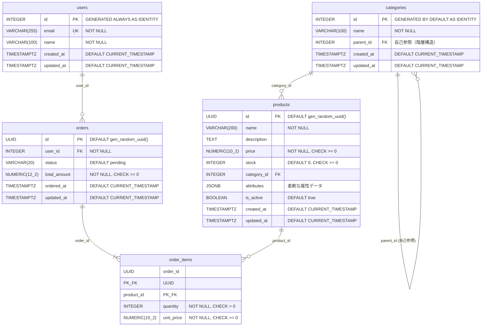

1.5章 テーブルの作成
---

# よく使うデータ型

## 数値型

| 型 | サイズ | 説明 |
|---|---|---|
| `SMALLINT` / `INT2` | 2バイト | 符号付き整数 |
| `INTEGER` / `INT` / `INT4` | 4バイト | 符号付き整数 |
| `BIGINT` / `INT8` | 8バイト | 符号付き整数 |
| `DECIMAL` / `NUMERIC` | サイズは可変 | 精度指定可能な正確な数値 <br> ※ 金額計算向け <br>  |
| `REAL` / `FLOAT4` | 4バイト | 単精度浮動小数点 <br> ※ 科学計算向け |
| `DOUBLE PRECISION` / `FLOAT8` | 8バイト | 倍精度浮動小数点 <br> ※ 科学計算向け |
| `SMALLSERIAL` / `SERIAL2` | 2バイト | 自動増分 (1 〜 32,767) |
| `SERIAL` / `SERIAL4` | 4バイト | 自動増分 (1 〜 2,147,483,647) |
| `BIGSERIAL` / `SERIAL8` | 8バイト | 自動増分 (1 〜 9,223,372,036,854,775,807) |

### NUMERIC

`NUMERIC(precision, scale)`:
- precision=全体の桁数(整数部+小数部)
- scale=小数点以下の桁数

```sql
-- NUMERIC
price NUMERIC(12, 2)   -- 一般的な金額(整数部=10桁, 小数部=2桁) (~99億)
price NUMERIC(3, 2)    -- 割合(整数部=1桁, 小数部=2桁) (0.00 - 9.99)
price NUMERIC          -- 度制限なし（任意の桁数を格納可能）
```

#### SERIAL, INTEGER

```sql
-- 自動採番（主キー用）
id SERIAL PRIMARY KEY               -- 旧形式
id INTEGER GENERATED ALWAYS AS IDENTITY PRIMARY KEY  -- 推奨
```

## 文字列型
| 型 | 説明 |
|----|------|
| `VARCHAR(n)` | 可変長文字列（最大n文字） |
| `CHAR(n)` | 固定長文字列（空白埋め） |
| `TEXT` | 可変長文字列（無制限） |


```sql
name VARCHAR(100)                   -- 可変長（最大100文字）
email TEXT                          -- 可変長（無制限）
code CHAR(5)                        -- 固定長（5文字、空白埋め）
```

## 日付・時刻型

| 型 | サイズ | 精度 | 説明 |
|----|--------|------|------|
| `TIMESTAMPTZ` | 8バイト | 1μ秒 14桁 | 日付と時刻（タイムゾーン付き） |
| `TIMESTAMP` | 8バイト | 1μ秒 14桁 | 日付と時刻（タイムゾーンなし） |
| `DATE` | 4バイト | 1日 | 日付のみ |
| `TIMETZ` | 12バイト | 1μ秒 14桁 | 時刻（タイムゾーン付き） |
| `TIME` | 8バイト | 1μ秒 14桁 | 時刻のみ（タイムゾーンなし） |

```sql
created_at TIMESTAMPTZ DEFAULT CURRENT_TIMESTAMP  -- 日時(タイムゾーン付き) (推奨) (CURRENT_TIMESTAMP は now()でもOK)
birth_date DATE                      -- 日時のみ
start_time TIMEZ                     -- 時刻のみ
```

### `now()` と `CURRENT_TIMESTAMP` の違い:
|  | `now()` | `CURRENT_TIMESTAMP` |
|------|---------|---------------------|
| 種類 | 関数 | SQL標準キーワード |
| 精度指定 | 不可 | 可能 <br>`CURRENT_TIMESTAMP(0)`: 秒まで<br>`CURRENT_TIMESTAMP(3)`: ミリ秒まで |
| 可搬性 | PostgreSQL固有 | SQL標準（他DBでも動く） |


## 真偽値

| 型 | 説明 |
|----|------|
| BOOLEAN | 真偽値 |

```sql
is_active BOOLEAN DEFAULT true       -- 真偽値
```

## JSONB・JSON型

PostgreSQLはJSON形式のデータを扱うためのデータ型としてJSONB型とJSON型を用意しています。  
JSONB型はインデックス可能です。


```sql
-- JSONBリテラル
SELECT '{"a": 1, "b": [1, 2, 3], "c": true}'::JSONB;
--                 jsonb                
-- -------------------------------------
--  {"a": 1, "b": [1, 2, 3], "c": true}

-- テーブル作成
CREATE TABLE products_1 (
  id SERIAL PRIMARY KEY,
  name TEXT NOT NULL,
  attributes JSONB
);

-- JSONデータを登録
INSERT INTO products_1 (name, attributes)
VALUES
  ('iPhone 15 Pro 256GB', '{"brand": "Apple", "color": "ナチュラルチタニウム", "storage": "256GB"}'),
  ('Galaxy S24 Ultra', '{"brand": "Samsung", "color": "チタニウムブラック", "storage": "512GB"}'),
  ('Pixel 8 Pro', '{"brand": "Google", "color": "Obsidian", "storage": "256GB"}');

-- カラムにJSONのパスを指定
SELECT name, attributes->>'brand' AS brand FROM products_1;
--         name         |  brand  
-- ---------------------+---------
--  iPhone 15 Pro 256GB | Apple
--  Galaxy S24 Ultra    | Samsung
--  Pixel 8 Pro         | Google

-- WHERE句でJSONの値で絞り込み
SELECT * FROM products_1 WHERE attributes->>'brand' = 'Apple';
--  id |        name         |                               attributes                                
-- ----+---------------------+-------------------------------------------------------------------------
--   1 | iPhone 15 Pro 256GB | {"brand": "Apple", "color": "ナチュラルチタニウム", "storage": "256GB"}
```


```sql
tags TEXT[]                          -- 配列
uuid_col UUID DEFAULT gen_random_uuid()  -- UUID
```

## ARRAY型

ARRAY型はPostgreSQL特有のデータ型で、複数の値を配列として格納できます。

```sql
-- 配列リテラル  NOTE： 配列のリテラルは {}
SELECT '{a,b,c}'::TEXT[];
--   text   
-- ---------
--  {a,b,c}
SELECT ARRAY[101, 102, 103];
--      array     
-- ---------------
--  {101,102,103}

-- テーブルの作成
CREATE TABLE orders_1 (
  id SERIAL PRIMARY KEY,
  customer_id INT NOT NULL,
  product_ids INT[]
);

-- ARRAYデータの挿入
INSERT INTO orders_1 (customer_id, product_ids)
VALUES
  (1, ARRAY[101, 102, 103]),
  (2, '{10, 20, 30}'::INT[]);

-- WHERE句でARRAYデータを指定
-- NOTE: 値 = ANY(配列) は "配列の要素が一つでも値と等しければ" という意味
SELECT * FROM orders_1 WHERE 102 = ANY(product_ids);
--  id | customer_id |  product_ids  
-- ----+-------------+---------------
--   1 |           1 | {101,102,103}
```

### `値 = ANY(配列)` 

`ANY` は `値 = ANY(配列)` という使われ方をする比較演算子で `=` や `>` 等といった比較演算子と同じ扱いをします。

```sql
-- これと...
WHERE 100 = ANY(amount_array)

-- ...これは同じ意味
WHERE (100 = amount_array[1])
   OR (100 = amount_array[2])
   OR (100 = amount_array[3]) ...
```


## UUID型

UUID型は128bitの一意識別子です。

```sql
-- UUID
SELECT gen_random_uuid();
--            gen_random_uuid            
-- --------------------------------------
--  d362dd27-459c-4a96-ad86-e4e5a89fecf0


CREATE TABLE users_1 (
  id UUID PRIMARY KEY DEFAULT gen_random_uuid(),
  name TEXT NOT NULL
);

INSERT INTO users_1 (name) VALUES ('田中将大'), ('ダルビッシュ有');

SELECT * FROM users_1;
--                   id                  |      name      
-- --------------------------------------+----------------
--  eb177e84-af5d-4870-a750-0f7d6127c4f5 | 田中将大
--  cef72431-1f81-4afc-be08-0ec962930232 | ダルビッシュ有
```


## ENUM型

Enum型は、取り得る値をあらかじめ定義することで、データの整合性を矯正するデータ型です。

```sql
-- ENUM型の定義
CREATE TYPE user_status AS ENUM (
  'active',
  'inactive',
  'suspended'
);

-- テーブル定義で使う
CREATE TABLE tmp_users (
  id SERIAL PRIMARY KEY,
  email TEXT NOT NULL,
  status user_status NOT NULL DEFAULT 'active'
);

-- 登録
INSERT INTO users (email, status) VALUES ('hoge@example.com', 'active');


-- 確認
select * from users;
--  id |      email       | status 
-- ----+------------------+--------
--   1 | hoge@example.com | active
```

#### `CHECK` 制約でデータを検証する方法もある
※ 変更が頻繁に起きそうならこっち

```sql
CREATE TABLE users (
  id SERIAL PRIMARY KEY,
  email TEXT NOT NULL,
  status TEXT NOT NULL DEFAULT 'active' CHECK (status IN ('active','inactive','suspended'))
);
```

## DOMAIN型

https://www.postgresql.jp/document/17/html/sql-createdomain.html

DOMAIN型は既存のデータ型に対して制約を更かした「カスタム型」です。

```sql
-- DOMAIN型の定義
CREATE DOMAIN positive_int AS INT CHECK (VALUE > 0);


-- テーブル定義で使う
CREATE TABLE items (
  id INTEGER GENERATED ALWAYS AS IDENTITY PRIMARY KEY,
  name VARCHAR(100) NOT NULL,
  price positive_int NOT NULL
);

-- 登録
INSERT INTO items (name, price) VALUES ('a', 100);

-- 制約に違反するとエラーになる
INSERT INTO items (name, price) VALUES ('b', 0);
-- ERROR:  value for domain positive_int violates check constraint "positive_int_check"


-- 確認
select * from items;
--  id | name | price 
-- ----+------+-------
--   1 | a    |   100
```

## SEQUENCE

https://www.postgresql.jp/document/17/html/sql-createsequence.html

SEQUENCEは、自動的に連番を生成するオブジェクトで、主キーやIDの生成に利用されます。  
SERIALやBIGSERIALも内部的にはシーケンスを利用しています。

NOTE: トランザクションのロールバック時などでギャップが発生する場合があります。


```sql
-- シーケンスの定義
CREATE SEQUENCE order_seq
  START 1000
  INCREMENT 1
  NO MINVALUE
  NO MAXVALUE
  CACHE 1;


-- テーブル作成
CREATE TABLE notes (
  id INTEGER PRIMARY KEY,
  name VARCHAR(100) NOT NULL,
  content TEXT NOT NULL DEFAULT ''
);


-- 登録
INSERT INTO notes (id, name)
VALUES
  (nextval('order_seq'), 'title_1'),
  (nextval('order_seq'), 'title_2'),
  (nextval('order_seq'), 'title_3');

-- 確認
SELECT * FROM notes;
--   id  |  name   | content 
-- ------+---------+---------
--  1000 | title_1 | 
--  1001 | title_2 | 
--  1002 | title_3 | 
```


# CREATE TABLE

## 基本形

```sql
CREATE TABLE users (
  id INTEGER GENERATED ALLWAYS AS IDENTITY PRIMARY KEY,
  name VARCHAR(200) NOT NULL,
  email VARCHAR(200) NOT NULL UNIQUE,
);
```

## 制約 (Constrait)

| パラメータ | 説明 |
| --- | --- |
| `NOT NULL` | NULL禁止 |
| `DEFAULT デフォルト値` | デフォルト値 |
| `PRIMARY KEY` | 主キー |
| `UNIQUE` | 一意制約 |
| `CHECK 条件` | 値の検証 |
| `REFERENCE テーブル(カラム)` | 外部キー制約 |
| `GENERATED {ALWAYS\|BY DEFAULT} AS IDENTITY` | 連番を生成<br>`ALWAYS`: 対象カラムに値を指定するとエラーになる<br>`BY DEFAULT` : 対象カラムに値を指定してデータを追加できる |


## 複合主キー・複合ユニークの設定

```sql
CREATE TABLE user_roles (
  user_id INTEGER NOT NULL,
  role_id INTEGER NOT NULL,
  assigned_at TIMESTAMPTZ DEFAULT CURRENT_TIMESTAMP,
  
  PRIMARY KEY (user_id, role_id),  -- 複合主キー
  UNIQUE (user_id, role_id, assigned_at)  -- 複合ユニーク
);
```

## 外部キーの設定
### 基本形

```sql
CREATE TABLE orders (
    id INTEGER GENERATED BY DEFAULT AS IDENTITY PRIMARY KEY,
    user_id integer REFERENCES users(id),
    product_id integer REFERENCES products(id)
);
```

### 削除時の動作指定

| アクション | 説明 |
|-----------|------|
| `ON DELETE CASCADE` | 親の削除/更新に追従 |
| `ON DELETE SET NULL` | NULLを設定 |
| `ON DELETE SET DEFAULT` | デフォルト値を設定 |
| `ON DELETE RESTRICT` | 操作を禁止（即時チェック） |
| `ON DELETE NO ACTION` | 操作を禁止（遅延チェック可、デフォルト） |

```sql
CREATE TABLE orders (
    id serial PRIMARY KEY,
    
    -- 親削除時に子も削除
    user_id integer REFERENCES users(id) ON DELETE CASCADE,
    
    -- 親削除時にNULLを設定
    category_id integer REFERENCES categories(id) ON DELETE SET NULL,
    
    -- 親削除を禁止（デフォルト）
    department_id integer REFERENCES departments(id) ON DELETE RESTRICT,
    
    -- 親更新時に子も更新
    status_code varchar(10) REFERENCES statuses(code) ON UPDATE CASCADE
);
```

### テーブルレベルで外部キーを定義

```sql
CREATE TABLE orders (
  id INTEGER GENERATED BY DEFAULT AS IDENTITY PRIMARY KEY,
  user_id INTEGER NOT NULL,
  product_id INTEGER NOT NULL,
  
  CONSTRAINT fk_user FOREIGN KEY (user_id) REFERENCES users(id) ON DELETE CASCADE,
  CONSTRAINT fk_product FOREIGN KEY (product_id) PREFERENCES products(id) ON DELETE RESTRICT
);
```

# パーティショニング (Partitioning)

パーティショニングはテーブルを複数の小さなパーティションに分割する手法であり、大量のデータが存在する場合にデータアクセスの効率化やパフォーマンス向上を目的に利用されます。  
大規模データやアーカイブ用途に向いています。ログや時系列データ、売上データなど、大量に蓄積されるデータで有効です。

特徴:
- テーブルを物理的に複数分割
- クエリ実行時に対象のパーティションのみを検索 (パーティションプルーニング)
- データ管理 (バックアップ、アーカイブ、削除)が効率化
- 大規模データベースのパフォーマンス向上


## パーティショニング方式

1. **範囲パーティショニング (Range Partitioning)** : 範囲に応じて分割 (日付や数値範囲)
1. **リストパーティショニング (List Partitioning)** : 列値のリストで分割
1. **ハッシュパーティショニング (Hash Partitioning)** : ハッシュ関数に基づく分割

## 例

```sql
CREATE TABLE sales (
  id INTEGER GENERATED BY DEFAULT AS IDENTITY,
  sale_date DATE NOT NULL,
  amount NUMERIC NOT NULL,

  -- NOTE: パーティションキーは必ず主キーに含めなければならない
  --       もし sale_date を主キーに含めない場合、データを1件INSERTするたびに、いくつものパーティションを全てスキャンして "このidは他のパーティションに存在しないか" を確認しなければならなくなります
  PRIMARY KEY (id, sale_date)
) PARTITION BY RANGE(sale_date);


-- パーティションの作成 (パーティションは運用者が定期的に管理(追加・削除)しなければならない)
CREATE TABLE sales_2025 PARTITION OF sales
  FOR VALUES FROM('2025-01-01') TO ('2026-01-01');
CREATE TABLE sales_2026 PARTITION OF sales
  FOR VALUES FROM('2026-01-01') TO ('2027-01-01');

-- 親テーブルにINSERTするだけで、自動で各パーティションに振り分けられる
INSERT INTO sales (sale_date, amount)
VALUES
  ('2025-05-10', 1000),  -- 自動的に sales_2025 に入る
  ('2026-02-20', 2000);  -- 自動的に sales_2026 に入る

-- WHERE句でパーティションキーを指定すると、関係ないパーティションへのスキャンは走らない
SELECT * FROM sales WHERE sale_date = '2025-05-10';
--  id | sale_date  | amount 
-- ----+------------+--------
--   1 | 2025-05-10 |   1000
```

# 継承テーブル (Table Inheritance)

継承テーブルは、あるテーブルを親として、そこから派生するテーブルを作成できます。  
共通カラムの再利用や柔軟な拡張が求められる場合に有効。複雑なデータ構造やオブジェクト指向的設計を取り入れる場面で活用されます。

```sql
-- 親テーブル
CREATE TABLE events (
    id SERIAL PRIMARY KEY,
    event_date DATE NOT NULL,
    description TEXT
);

-- 派生テーブル
CREATE TABLE conference_events (
    speaker TEXT
) INHERITS (events);

-- 派生テーブル
CREATE TABLE webinar_events (
  url TEXT
) INHERITS (events);

-- 親テーブル、派生テーブルにデータを挿入
INSERT INTO events (event_date, description) VALUES ('2026-01-01', 'events data');
INSERT INTO conference_events (event_date, description, speaker) VALUES ('2026-01-01', 'conference_events data', 'midori');
INSERT INTO webinar_events (event_date, description, url) VALUES ('2026-01-01', 'webinar_events data', 'http://example.com/1');

-- 親テーブルを指定すると全ての派生テーブルを検索
SELECT * FROM events;
-- id | event_date |      description       
-- ----+------------+------------------------
--   1 | 2026-01-01 | events data
--   2 | 2026-01-01 | conference_events data
--   3 | 2026-01-01 | webinar_events data

 -- ONLY指定で基底テーブルのみ検索
SELECT * FROM ONLY events;
--  id | event_date | description 
-- ----+------------+-------------
--   1 | 2026-01-01 | events data

-- 派生テーブルを検索
select * from conference_events;
--  id | event_date |      description       | speaker 
-- ----+------------+------------------------+---------
--   2 | 2026-01-01 | conference_events data | midori
```


# テーブル値コンストラクタ（table value constructor）

その場で作った集合をテーブルとして扱える機能です。

基本構文

```
VALUES (v1, v2, ...), ...;
```

サンプル

```sql
VALUES (1, 'a'), (2, 'b');
--  column1 | column2 
-- ---------+---------
--        1 | a
--        2 | b
```

## 使い所

### `FROM` でテーブルとして扱える

```sql
SELECT *
FROM (VALUES (1, 'red'), (2, 'blue'), (3, 'green')) AS colors(id, name);
--  id | name  
-- ----+-------
--   1 | red
--   2 | blue
--   3 | green
```

### `JOIN` の対象に指定できる

```sql
SELECT o.id, products.id
FROM orders o
CROSS JOIN (VALUES (1), (2)) AS products(id);
--                   id                  | id 
-- --------------------------------------+----
--  4e50b027-66e2-4081-8dbf-0c77e009571f |  1
--  4e50b027-66e2-4081-8dbf-0c77e009571f |  2
--  8a1f9e40-27ef-4381-adfc-203691b8ad13 |  1
--  8a1f9e40-27ef-4381-adfc-203691b8ad13 |  2
```


# サンプルテーブル

## サンプルデータの登録

[テーブル定義+サンプルデータ initial_data.sql (54.2 kB)](./resources/initial_data.sql)

```bash
PGPASSWORD=root1234 psql -U app -h ${DB_HOST} -d sample -p 5432 -f initial_data.sql
```
## ER図



## テーブル定義

```sql
-- gen_random_uuid() を利用するために必要
CREATE EXTENSION IF NOT EXISTS pgcrypto;
-- GIN + trigramインデックスを利用するために必要
CREATE EXTENSION IF NOT EXISTS pg_trgm;

-- ユーザー
CREATE TABLE IF NOT EXISTS users (
  id INTEGER GENERATED ALWAYS AS IDENTITY PRIMARY KEY,
  email VARCHAR(255) UNIQUE NOT NULL,
  name VARCHAR(100) NOT NULL,
  created_at TIMESTAMPTZ DEFAULT CURRENT_TIMESTAMP NOT NULL,
  updated_at TIMESTAMPTZ DEFAULT CURRENT_TIMESTAMP NOT NULL
);

-- カテゴリ
CREATE TABLE IF NOT EXISTS categories (
  id INTEGER GENERATED BY DEFAULT AS IDENTITY PRIMARY KEY,
  name VARCHAR(100) NOT NULL,
  parent_id INTEGER REFERENCES categories(id) ON DELETE RESTRICT,
  created_at TIMESTAMPTZ DEFAULT CURRENT_TIMESTAMP NOT NULL,
  updated_at TIMESTAMPTZ DEFAULT CURRENT_TIMESTAMP NOT NULL,

  UNIQUE (name, parent_id)
);

-- 商品
CREATE TABLE IF NOT EXISTS products (
  id UUID DEFAULT gen_random_uuid() PRIMARY KEY,
  name VARCHAR(200) NOT NULL,
  description TEXT,
  price NUMERIC(10, 2) NOT NULL CHECK (price >= 0),
  stock INTEGER DEFAULT 0 CHECK (stock >= 0),
  category_id INTEGER REFERENCES categories(id) ON DELETE SET NULL,
  attributes JSONB,
  is_active BOOLEAN DEFAULT true,
  created_at TIMESTAMPTZ DEFAULT CURRENT_TIMESTAMP NOT NULL,
  updated_at TIMESTAMPTZ DEFAULT CURRENT_TIMESTAMP NOT NULL
);

-- 注文
CREATE TABLE IF NOT EXISTS orders (
  id UUID DEFAULT gen_random_uuid() PRIMARY KEY,
  user_id INTEGER NOT NULL REFERENCES users(id) ON DELETE RESTRICT,
  status VARCHAR(20) DEFAULT 'pending' CHECK (status IN ('pending', 'paid', 'shipped', 'delivered', 'cancelled')),
  total_amount NUMERIC(12,2) NOT NULL CHECK (total_amount >= 0),
  ordered_at TIMESTAMPTZ DEFAULT CURRENT_TIMESTAMP NOT NULL,
  updated_at TIMESTAMPTZ DEFAULT CURRENT_TIMESTAMP NOT NULL
);

-- 注文明細 (多対多)
CREATE TABLE IF NOT EXISTS order_items (
  order_id UUID NOT NULL REFERENCES orders(id) ON DELETE CASCADE,
  product_id UUID NOT NULL REFERENCES products(id) ON DELETE RESTRICT,
  quantity INTEGER NOT NULL CHECK (quantity > 0),
  unit_price NUMERIC(10, 2) NOT NULL CHECK (unit_price >= 0),

  PRIMARY KEY (order_id, product_id)
);

-- インデックス
CREATE INDEX IF NOT EXISTS idx_products_category_id ON products(category_id);
CREATE INDEX IF NOT EXISTS idx_products_is_active ON products(is_active);
CREATE INDEX IF NOT EXISTS idx_products_name_trgm ON products USING GIN (lower(name) gin_trgm_ops); -- 小文字に寄せる

CREATE INDEX IF NOT EXISTS idx_orders_user_id ON orders(user_id);
CREATE INDEX IF NOT EXISTS idx_orders_ordered_at ON orders(ordered_at);
CREATE INDEX IF NOT EXISTS idx_orders_status ON orders(status);

CREATE INDEX IF NOT EXISTS idx_order_items_order_id ON order_items(order_id);
CREATE INDEX IF NOT EXISTS idx_order_items_product_id ON order_items(product_id);


CREATE OR REPLACE FUNCTION update_updated_at()
RETURNS TRIGGER AS $$
BEGIN
  NEW.updated_at = now();
  RETURN NEW;
END;
$$ LANGUAGE plpgsql;

CREATE TRIGGER trigger_update_updated_at_users
  BEFORE UPDATE ON users
  FOR EACH ROW
  EXECUTE FUNCTION update_updated_at();

CREATE TRIGGER trigger_update_updated_at_categories
  BEFORE UPDATE ON categories
  FOR EACH ROW
  EXECUTE FUNCTION update_updated_at();

CREATE TRIGGER trigger_update_updated_at_products
  BEFORE UPDATE ON products
  FOR EACH ROW
  EXECUTE FUNCTION update_updated_at();

CREATE TRIGGER trigger_update_updated_at_orders
  BEFORE UPDATE ON orders
  FOR EACH ROW
  EXECUTE FUNCTION update_updated_at();
```
